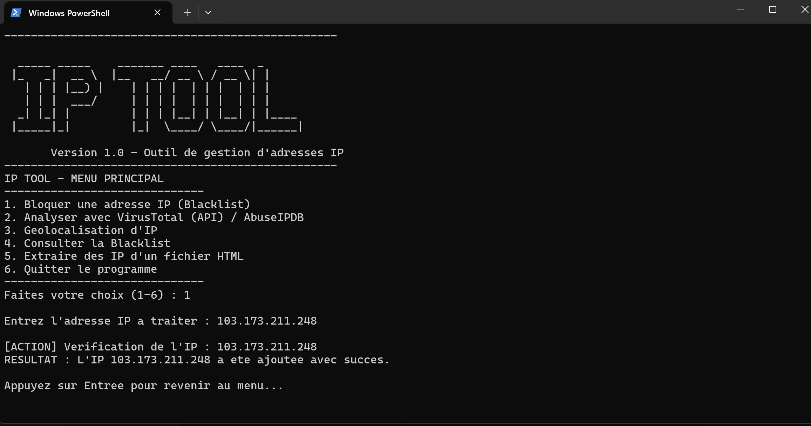

# IP TOOL

**IP TOOL** is a command line utility designed for system administrators and cybersecurity analysts. It allows you to manage local blacklists, geolocate addresses, and assess the danger level of connections via third-party services.

The tool automates reputation analysis by querying the **VirusTotal** and **AbuseIPDB** APIs to provide an immediate and accurate risk score.

---

## 📸 Screenshot

---

## ✨ Features

* **🛡️ Blacklist Management**: Securely add IP addresses to a `blacklist.txt` file with automatic duplicate detection.
* **🔍 Multi-API Analysis**: Retrieval of the number of malicious detections on VirusTotal and the suspicion score on AbuseIPDB.
* **🌍 Live Geolocation**: Identification of the country, city, ISP (provider) and GPS coordinates via the ip-api API.
* **📄 HTML extractor**: Automatic scanning of files (e.g. `test.html`) to extract all valid IPv4 addresses and save them in `IpATraiter.txt`.
* **💻 Console experience**: Smooth interface with automated screen clearing for Windows (`cls`) and Linux/Mac (`clear`).

---

## 🛠 Tech Stack

* **Backend** : Python 3.11+
* **Libraries** : `requests`, `python-dotenv`, `re`
* **External APIs** : VirusTotal v3, AbuseIPDB v2, IP-API

---

## 🚀 How to run

### 1. Clone the project

bash

git clone [https://github.com/Akaonii/Ip-Tool.git](https://github.com/Akaonii/Ip-Tool.git)

cd Ip-Tool

2. Installation of dependencies
   
Bash
pip install requests python-dotenv

3. API key configuration
   
Create an .env file in the root folder and add your credentials:

Code snippet

VT_API_KEY=votre_cle_virustotal

ABUSEIPDB_API_KEY=votre_cle_abuseipdb

4. Launch the application

Bash

python main.p

📄 Licence
Distributed under the MIT Licence. See the LICENCE file for more information.

